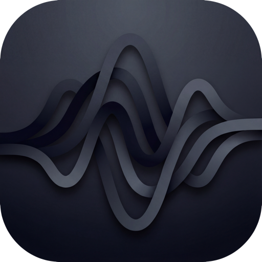

<p align="center">
  
</p>

<h1 align="center">Resonance</h1>

<p align="center">
  <strong>Self-hosted music streaming with AI-powered features</strong>
</p>

<p align="center">
  <a href="https://github.com/resonance-stream/resonance/actions/workflows/ci.yml"></a>
  <a href="https://github.com/resonance-stream/resonance/actions/workflows/security.yml"></a>
  <a href="https://github.com/resonance-stream/resonance/actions/workflows/docker.yml"></a>
  <a href="https://github.com/resonance-stream/resonance/actions/workflows/release.yml"></a>
</p>

<p align="center">
  <a href="#features"></a>
  <a href="#license"></a>
  <a href="#tech-stack"></a>
  <a href="#tech-stack"></a>
  <a href="#tech-stack"></a>
</p>

---

## Overview

Resonance is a self-hosted Spotify-like music streaming platform that brings AI-powered features to your personal music library. With seamless Lidarr integration, real-time cross-device sync, and intelligent recommendations, Resonance transforms how you experience your music collection.

## Features

### 🎵 Music Playback
- **Gapless playback** - Seamless transitions between tracks
- **Crossfade** - Smooth audio blending between songs
- **10-band equalizer** - Fine-tune your listening experience
- **Smart transcoding** - Automatic or manual quality selection

### 🎨 Visual Experience
- **Album art visualizer** - Dynamic visualizations based on cover art colors
- **Responsive design** - Beautiful interface on any device

### 🤖 AI-Powered Features
- **Mood detection** - Automatic mood and vibe analysis
- **Natural language search** - Find music using conversational queries
- **Auto-tagging** - Intelligent metadata enrichment
- **AI chat assistant** - Get music recommendations through conversation
- **Weekly Discover playlist** - AI-curated discoveries, auto-downloaded

### 📚 Library Management
- **Lidarr integration** - Automatic library sync and downloads
- **Smart playlists** - Dynamic playlists based on rules
- **Collaborative playlists** - Share and co-edit with friends
- **Synced lyrics** - Karaoke-style lyrics with static fallback

### 🔄 Real-Time Sync
- **Cross-device playback** - Seamless handoff between devices
- **Device transfer** - One-click playback transfer
- **Presence system** - See what's playing across all devices

### 🔗 Integrations
- **Discord Rich Presence** - Show what you're listening to
- **ListenBrainz** - Scrobble your listening history

### 📱 Progressive Web App
- **Offline support** - Download playlists for offline listening
- **Unlimited caching** - Cache as much as your device allows
- **Background sync** - Sync history when back online

---

## Quick Start

### Prerequisites

Before you begin, ensure you have the following installed:

- [Docker](https://docs.docker.com/get-docker/) (v24.0+)
- [Docker Compose](https://docs.docker.com/compose/install/) (v2.20+)
- [Lidarr](https://lidarr.audio/) (configured with your music library)

### Installation

1. **Clone the repository**
   ```bash
   git clone https://github.com/resonance-stream/resonance.git
   cd resonance
   ```

2. **Copy the environment template**
   ```bash
   cp .env.example .env
   ```

3. **Configure environment variables**

   Edit `.env` and set the required values:
   ```bash
   # Required
   DB_PASSWORD=your_secure_database_password
   JWT_SECRET=your_secure_jwt_secret_min_32_chars
   MEILISEARCH_KEY=your_meilisearch_master_key
   LIDARR_URL=http://your-lidarr-instance:8686
   LIDARR_API_KEY=your_lidarr_api_key
   MUSIC_LIBRARY_PATH=/path/to/your/music
   ```

4. **Start the services**
   ```bash
   docker compose up -d
   ```

5. **Access Resonance**

   Open your browser and navigate to:
   ```
   http://localhost:8080
   ```

6. **Create your first user**

   Follow the on-screen setup wizard to create your admin account.

---

## Configuration

### Environment Variables

| Variable | Required | Default | Description |
|----------|----------|---------|-------------|
| `DB_PASSWORD` | Yes | - | PostgreSQL database password |
| `JWT_SECRET` | Yes | - | Secret key for JWT tokens (min 32 characters) |
| `MEILISEARCH_KEY` | Yes | - | Meilisearch master key for search |
| `LIDARR_URL` | Yes | - | URL to your Lidarr instance |
| `LIDARR_API_KEY` | Yes | - | Lidarr API key for integration |
| `MUSIC_LIBRARY_PATH` | Yes | - | Path to your music library directory |
| `PORT` | No | `8080` | Port for the web interface |
| `OLLAMA_MODEL` | No | `mistral` | AI model to use with Ollama |
| `LISTENBRAINZ_API_KEY` | No | - | API key for ListenBrainz scrobbling |
| `DISCORD_CLIENT_ID` | No | - | Discord app client ID for Rich Presence |

### Docker Compose Services

| Service | Image | Purpose |
|---------|-------|---------|
| `resonance` | Custom | Main API server |
| `resonance-worker` | Custom | Background job processor |
| `postgres` | `pgvector/pgvector:pg16` | Database with vector support |
| `redis` | `redis:7-alpine` | Cache and pub/sub |
| `meilisearch` | `getmeili/meilisearch:v1.6` | Full-text search |
| `ollama` | `ollama/ollama` | Local AI inference |

---

## Architecture

### System Overview

```
┌─────────────────────────────────────────────────────────────┐
│                        Clients                               │
│  (Web PWA, Mobile PWA, Future: React Native)                │
└──────────────────────────┬──────────────────────────────────┘
                           │
                    ┌──────▼──────┐
                    │   Traefik/  │
                    │   Cloudflare│
                    │    Tunnel   │
                    └──────┬──────┘
                           │
┌──────────────────────────▼──────────────────────────────────┐
│                    Resonance API                             │
│  ┌─────────┐ ┌─────────┐ ┌─────────┐ ┌─────────┐           │
│  │  Auth   │ │ Library │ │Playback │ │   AI    │           │
│  └────┬────┘ └────┬────┘ └────┬────┘ └────┬────┘           │
│       │           │           │           │                  │
│  ┌────▼───────────▼───────────▼───────────▼────┐            │
│  │              Core Services                   │            │
│  │  (Streaming, Sync, Recommendations, Search)  │            │
│  └──────────────────────────────────────────────┘            │
└──────────────────────────┬──────────────────────────────────┘
                           │
        ┌──────────────────┼──────────────────┐
        │                  │                  │
   ┌────▼────┐       ┌─────▼─────┐      ┌─────▼─────┐
   │PostgreSQL│       │   Redis   │      │Meilisearch│
   │+pgvector │       │           │      │           │
   └──────────┘       └───────────┘      └───────────┘
        │
   ┌────▼────┐       ┌───────────┐      ┌───────────┐
   │  Ollama │       │  Lidarr   │      │  Music    │
   │  (AI)   │       │   API     │      │  Library  │
   └─────────┘       └───────────┘      └───────────┘
```

### Real-Time Sync Architecture

```
Device A ──────┐
               │     ┌─────────────────┐
Device B ──────┼────►│  Redis Pub/Sub  │◄───► WebSocket Server
               │     │  user:{id}:*    │
Device C ──────┘     └─────────────────┘
```

### Project Structure

```
resonance/
├── .github/
│   ├── actions/                # Reusable composite actions
│   │   ├── rust-setup/         # Rust toolchain setup
│   │   └── setup-node-pnpm/    # Node.js + pnpm setup
│   └── workflows/              # CI/CD workflows
│
├── apps/
│   ├── api/                    # Rust backend
│   │   ├── src/
│   │   │   ├── routes/         # HTTP/GraphQL endpoints
│   │   │   ├── services/       # Business logic
│   │   │   ├── models/         # Database models
│   │   │   ├── websocket/      # Real-time sync
│   │   │   └── graphql/        # GraphQL schema
│   │   ├── migrations/         # SQLx database migrations
│   │   └── Cargo.toml
│   │
│   ├── worker/                 # Background job processor
│   │   └── src/
│   │       └── jobs/           # Scheduled tasks
│   │
│   └── web/                    # React frontend
│       └── src/
│           ├── components/     # UI components
│           ├── hooks/          # Custom hooks
│           ├── stores/         # Zustand stores
│           ├── lib/            # Utilities
│           └── pages/          # Route pages
│
├── packages/
│   ├── shared-config/          # Shared Rust configuration
│   └── shared-types/           # Shared TypeScript types
│
├── docker/
│   ├── Dockerfile              # API container
│   └── Dockerfile.worker       # Worker container
│
├── docker-compose.yml
├── .env.example
└── README.md
```

---

## Production Deployment

For production deployments, see the comprehensive [Deployment Guide](DEPLOYMENT.md) which covers:

- **Prerequisites & System Requirements** - Hardware and software requirements
- **Environment Configuration** - Secure secret generation and configuration
- **Docker Compose Production Setup** - Production-optimized container configuration
- **HTTPS & Reverse Proxy** - SSL/TLS setup with Caddy, Traefik, or nginx
- **Security Hardening** - Firewall, Docker security, and best practices
- **Backup Procedures** - Automated backups and disaster recovery
- **Monitoring & Logging** - Health checks, log management, and alerting
- **Upgrade Procedures** - Safe upgrade and rollback processes

### Quick Production Start

```bash
# Clone and configure
git clone https://github.com/resonance-stream/resonance.git
cd resonance
cp .env.example .env.production

# Generate secure secrets
echo "DB_PASSWORD=$(openssl rand -base64 24)"
echo "JWT_SECRET=$(openssl rand -base64 32)"
echo "MEILISEARCH_KEY=$(openssl rand -base64 32)"

# Update .env.production with your configuration, then:
docker compose -f docker-compose.prod.yml --env-file .env.production up -d
```

### Production Compose Features

The production Docker Compose file (`docker-compose.prod.yml`) includes:

| Feature | Description |
|---------|-------------|
| **Resource Limits** | CPU and memory limits prevent runaway containers |
| **Health Checks** | All services have health checks with proper conditions |
| **Log Rotation** | Automatic log rotation with compression |
| **Security Options** | `no-new-privileges`, read-only filesystems where possible |
| **Restart Policies** | Automatic restart on failure |
| **Network Isolation** | Services only accessible within Docker network |

---

## Development

### Prerequisites

For local development, you'll need:

- [Rust](https://rustup.rs/) (1.75+)
- [Node.js](https://nodejs.org/) (20+)
- [pnpm](https://pnpm.io/) (8+)
- [Docker](https://docs.docker.com/get-docker/) (for services)

### Backend Development

```bash
# Start infrastructure services
docker compose up postgres redis meilisearch ollama -d

# Navigate to the API directory
cd apps/api

# Run with hot reload
cargo watch -x run

# Run tests
cargo test

# Run tests with coverage
cargo tarpaulin
```

### Frontend Development

```bash
# Navigate to the web directory
cd apps/web

# Install dependencies
pnpm install

# Start development server
pnpm dev

# Run type checking
pnpm typecheck

# Run linting
pnpm lint

# Build for production
pnpm build
```

### Database Migrations

```bash
# Run migrations
cd apps/api
sqlx migrate run

# Create a new migration
sqlx migrate add <migration_name>

# Revert last migration
sqlx migrate revert
```

### Running the Full Stack

```bash
# Start all services in development mode
docker compose -f docker-compose.dev.yml up

# Or run services individually:
# Terminal 1: Infrastructure
docker compose up postgres redis meilisearch ollama -d

# Terminal 2: Backend
cd apps/api && cargo watch -x run

# Terminal 3: Frontend
cd apps/web && pnpm dev
```

---

## API Documentation

### GraphQL API

The primary API uses GraphQL for flexible querying and real-time subscriptions.

**Endpoint:** `/graphql`

**Playground:** Available at `/graphql/playground` in development mode.

Key operations:
- **Queries:** Library browsing, search, recommendations, playlists
- **Mutations:** Authentication, playlist management, user settings
- **Subscriptions:** Playback sync, device presence

### REST Endpoints

Specialized endpoints for specific use cases:

| Endpoint | Method | Description |
|----------|--------|-------------|
| `/stream/:trackId` | GET | Audio streaming with range support |
| `/webhooks/lidarr` | POST | Lidarr download notifications |
| `/health` | GET | Health check endpoint |

Full API documentation will be available at `/docs` when the server is running.

---

## Tech Stack

| Category | Technology | Purpose |
|----------|------------|---------|
| **Backend** | Rust + Axum | Web framework & API server |
| **Runtime** | Tokio | Async runtime |
| **Database** | PostgreSQL 16 + pgvector | Primary data store + vector search |
| **Cache** | Redis 7 | Caching, sessions, pub/sub |
| **Search** | Meilisearch | Full-text search with typo tolerance |
| **AI** | Ollama | Local LLM inference |
| **Frontend** | React 18 + TypeScript | UI framework |
| **Build Tool** | Vite | Fast frontend builds |
| **State** | Zustand + TanStack Query | Client & server state |
| **Components** | Radix UI | Accessible component primitives |
| **Audio** | Web Audio API + Symphonia | Audio processing |
| **PWA** | Workbox | Offline support |
| **API** | async-graphql | GraphQL server |
| **Deployment** | Docker Compose | Container orchestration |

---

## Contributing

We welcome contributions! Please follow these steps:

1. **Fork the repository**

2. **Create a feature branch**
   ```bash
   git checkout -b feature/your-feature-name
   ```

3. **Make your changes**
   - Follow the existing code style
   - Add tests for new functionality
   - Update documentation as needed

4. **Run checks**
   ```bash
   # Backend
   cargo fmt && cargo clippy && cargo test

   # Frontend
   pnpm lint && pnpm typecheck && pnpm test
   ```

5. **Commit your changes**
   ```bash
   git commit -m "feat(scope): add your feature description"
   ```

   We use [Conventional Commits](https://www.conventionalcommits.org/):
   - `feat:` New features
   - `fix:` Bug fixes
   - `docs:` Documentation changes
   - `refactor:` Code refactoring
   - `test:` Adding tests

6. **Push and create a Pull Request**
   ```bash
   git push origin feature/your-feature-name
   ```

### Development Guidelines

- Write meaningful commit messages
- Keep PRs focused on a single change
- Add tests for new functionality
- Update documentation for user-facing changes
- Ensure CI passes before requesting review

---

## License

This project is licensed under the MIT License - see the [LICENSE](LICENSE) file for details.

---

## Acknowledgments

Resonance is built on the shoulders of giants:

- [Axum](https://github.com/tokio-rs/axum) - Ergonomic Rust web framework
- [Symphonia](https://github.com/pdeljanov/Symphonia) - Pure Rust audio decoding
- [pgvector](https://github.com/pgvector/pgvector) - Vector similarity search for PostgreSQL
- [Meilisearch](https://www.meilisearch.com/) - Lightning fast search engine
- [Ollama](https://ollama.ai/) - Run LLMs locally
- [Lidarr](https://lidarr.audio/) - Music collection manager
- [Radix UI](https://www.radix-ui.com/) - Accessible React components
- [TanStack Query](https://tanstack.com/query) - Powerful async state management

Special thanks to all open-source contributors who make projects like this possible.

---

<p align="center">
  Made with 🎵 by the Resonance team
</p>
